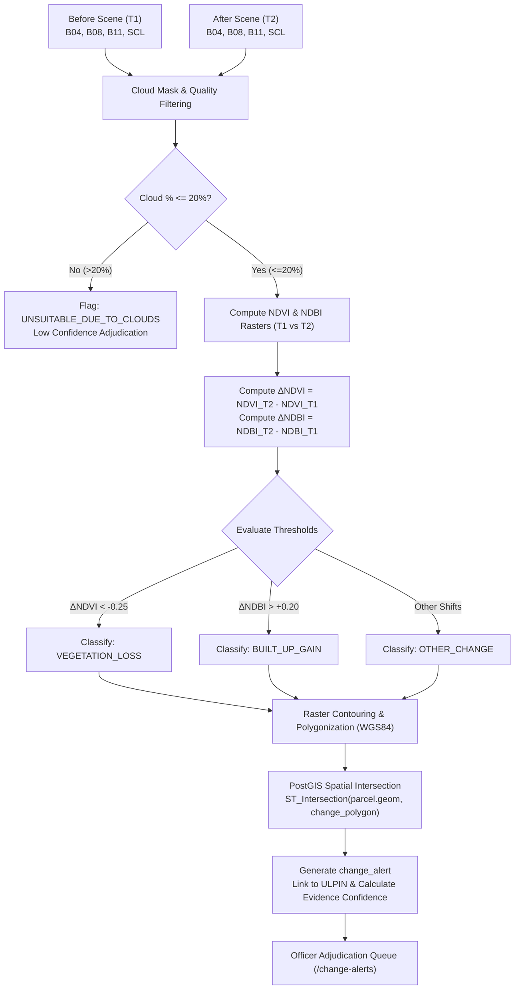

# GeoDhara: Automated Satellite Change Detection Subsystem

## Overview & Transparency Statement

> [!IMPORTANT]
> **Transparent Governance Standard:**
> GeoDhara's satellite change monitoring uses **Automated Spectral Index Differencing & PostGIS Spatial Intersection** — **NOT a black-box AI model**. 
> 
> All detections are generated through deterministically verifiable physical radiometry equations ($NDVI$ and $NDBI$) calculated on Copernicus Sentinel-2 Level-2A (Bottom-of-Atmosphere surface reflectance) bands.
> 
> **Human Verification is strictly required** before any change alert can be recorded as a statutory title impediment or ground infraction.

---

## 1. Sentinel-2 Spectral Bands & Physics

GeoDhara processes Sentinel-2 MultiSpectral Instrument (MSI) Level-2A surface reflectance rasters:

| Sentinel-2 Band | Central Wavelength ($\lambda$) | Spatial Resolution | Physical Utility in GeoDhara |
| :--- | :--- | :--- | :--- |
| **B04 (Red)** | $665\text{ nm}$ | $10\text{ m}$ | Chlorophyll absorption spectrum (vegetation absorbs red light) |
| **B08 (NIR)** | $842\text{ nm}$ | $10\text{ m}$ | Leaf mesophyll structure scattering (dense vegetation strongly reflects NIR) |
| **B11 (SWIR-1)** | $1610\text{ nm}$ | $20\text{ m}$ | Impervious surface / concrete & moisture sensitivity |
| **SCL (Scene Classification)** | N/A | $20\text{ m}$ | ESA atmospheric classification (Cloud mask, shadow, snow) |

---

## 2. Radiometric Spectral Indices

### A. Normalized Difference Vegetation Index (NDVI)
$$NDVI = \frac{\rho_{\text{NIR}} - \rho_{\text{Red}}}{\rho_{\text{NIR}} + \rho_{\text{Red}} + \epsilon} = \frac{B08 - B04}{B08 + B04 + 10^{-6}}$$
- Dense healthy tree canopy: $NDVI \in [0.60, 0.85]$
- Shrub / pasture: $NDVI \in [0.25, 0.50]$
- Bare ground / cleared soil: $NDVI \in [0.05, 0.20]$
- Built concrete / water: $NDVI \le 0.0$

### B. Normalized Difference Built-up Index (NDBI)
$$NDBI = \frac{\rho_{\text{SWIR}} - \rho_{\text{NIR}}}{\rho_{\text{SWIR}} + \rho_{\text{NIR}} + \epsilon} = \frac{B11 - B08}{B11 + B08 + 10^{-6}}$$
- Concrete buildings, metal roofs, paved roads: $NDBI > +0.10$
- Vegetation & soil: $NDBI < 0.0$

---

## 3. Differencing & Classification Pipeline



---

## 4. Evidence-Derived Confidence Calculation

GeoDhara **does not fabricate an AI accuracy metric**. Instead, it computes an auditable **Detection Confidence Score** ($0.0 - 1.0$) based strictly on radiometric and geometric evidence:

$$\text{Confidence} = C_{\text{atmospheric}} \times C_{\text{magnitude}} \times C_{\text{spatial}}$$

Where:
1. **Atmospheric Purity ($C_{\text{atmospheric}}$):**
   $$C_{\text{atmospheric}} = 1.0 - \min\left(1.0, \frac{\text{cloud\_cover\_pct}}{50\%}\right)$$
2. **Spectral Contrast Magnitude ($C_{\text{magnitude}}$):**
   $$C_{\text{magnitude}} = \min\left(1.0, \frac{|\Delta \text{Index}|}{\text{Threshold} \times 1.8}\right)$$
3. **Spatial Scale Significance ($C_{\text{spatial}}$):**
   $$C_{\text{spatial}} = \min\left(1.0, \frac{\text{Affected Area (m}^2\text{)}}{300\text{ m}^2}\right)$$

---

## 5. Fetching Full Sentinel-2 Scenes in Production

To acquire 100km $\times$ 100km Sentinel-2 L2A tiles for your jurisdiction:

### Option 1: Copernicus Data Space Ecosystem (CDSE)
1. Register free at [dataspace.copernicus.eu](https://dataspace.copernicus.eu).
2. Search tile identifier (e.g. `T44QKB` for Hyderabad / Medchal or `T43PGP` for Bangalore).
3. Download product archive (Level-2A BOA Reflectance).

### Option 2: AWS Open Data Program (Direct S3)
```bash
# Example AWS CLI fetch for Sentinel-2 Tile 44QKB without authentication
aws s3 cp s3://sentinel-cogs/sentinel-s2-l2a-cogs/44/Q/KB/2024/6/S2B_44QKB_20240615_0_L2A/B04.tif ./B04.tif --no-sign-request
aws s3 cp s3://sentinel-cogs/sentinel-s2-l2a-cogs/44/Q/KB/2024/6/S2B_44QKB_20240615_0_L2A/B08.tif ./B08.tif --no-sign-request
aws s3 cp s3://sentinel-cogs/sentinel-s2-l2a-cogs/44/Q/KB/2024/6/S2B_44QKB_20240615_0_L2A/B11.tif ./B11.tif --no-sign-request
aws s3 cp s3://sentinel-cogs/sentinel-s2-l2a-cogs/44/Q/KB/2024/6/S2B_44QKB_20240615_0_L2A/SCL.tif ./SCL.tif --no-sign-request
```

### Option 3: Google Earth Engine (Python / JavaScript)
```javascript
var collection = ee.ImageCollection('COPERNICUS/S2_SR_HARMONIZED')
  .filterBounds(parcelGeometry)
  .filterDate('2024-01-01', '2024-06-30')
  .filter(ee.Filter.lt('CLOUDY_PIXEL_PERCENTAGE', 10));
```
